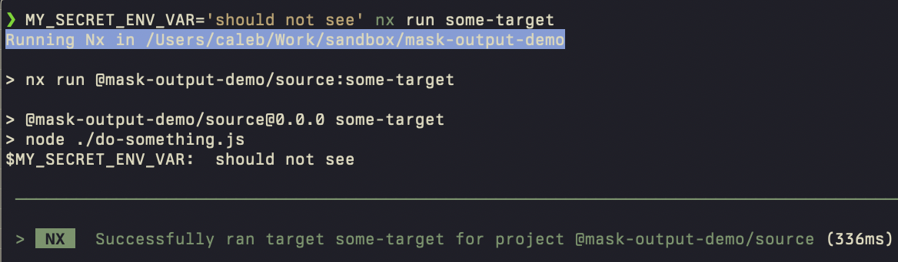
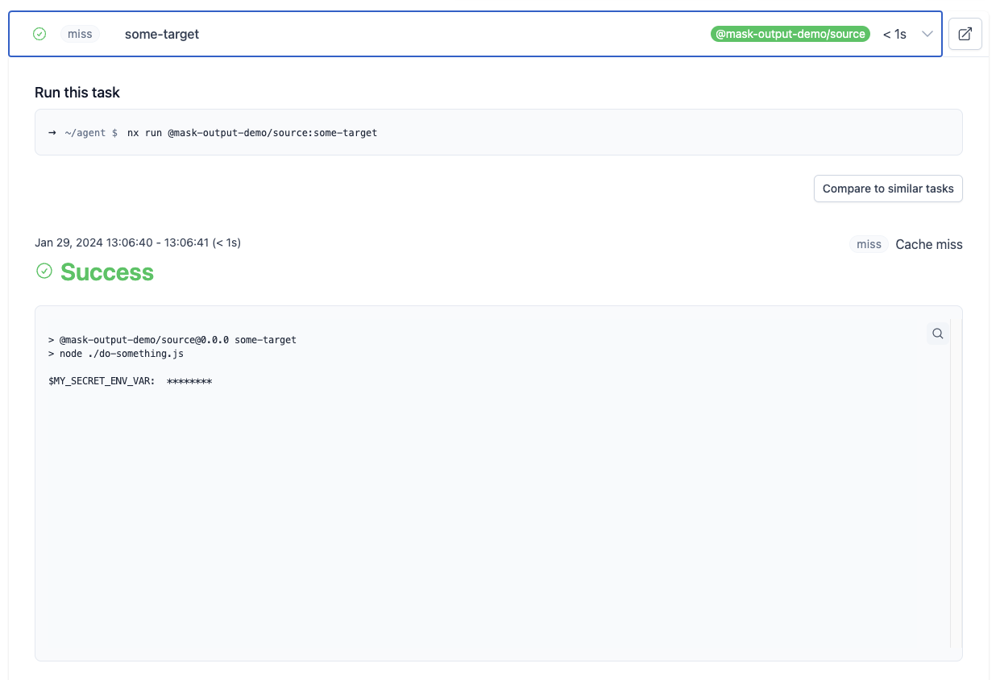

# Mask Nx Cloud Terminal Output

use `maskProperties` within [`nx.json`](./nx.json) with the env var value that should be removed from the terminalOutput

Output shown locally

Output seen via Nx Cloud

